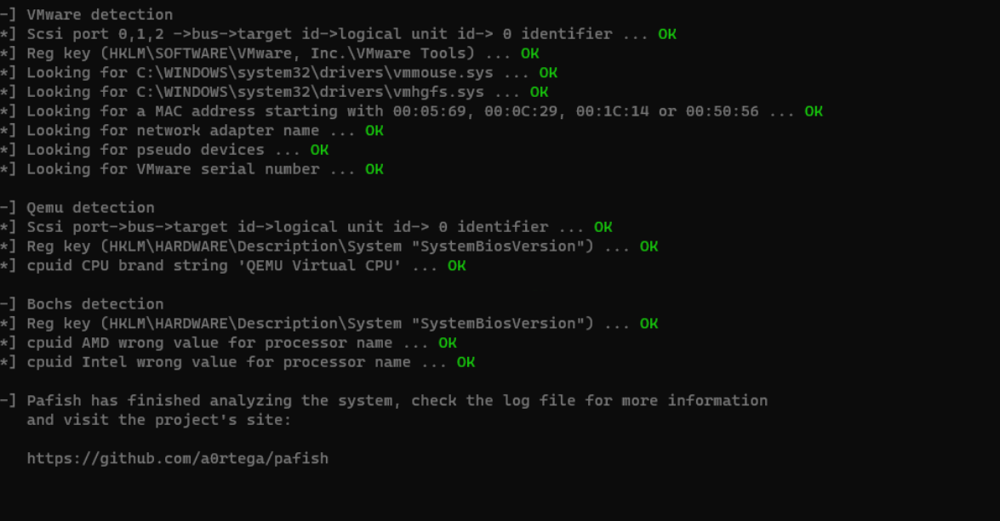

# VM Anti-Detection: Build an Undetectable Virtual Machine

This project guides you through creating a virtual machine (VM) that evades detection by software like anti-cheat systems, malware analysis tools, and licensing software. Using a patched QEMU and custom configurations from the `qemu-anti-detection` project, your VM will masquerade as a physical machine, bypassing most detection methods. Whether you’re a gamer, researcher, or privacy enthusiast, this setup offers a stealthy virtualization solution.

## Why Go Undetectable?

Software often checks for VMs to:
- Block cheats in games (e.g., Easy Anti-Cheat, Vanguard).
- Prevent malware from running in analysis sandboxes.
- Restrict licensed apps to physical hardware.

By masking VM traces, like “QEMU” device names, hypervisor flags, or timing quirks, you can run your software without detection. This guide leverages the `qemu-anti-detection` project to rename hardware, hide system info, and conceal the hypervisor, making your VM nearly indistinguishable from real hardware.

**Note**: This is for advanced users with Linux experience. Use responsibly and legally.

## What You’ll Achieve

- **Build a patched QEMU**: Modify QEMU to hide virtualization signatures.
- **Configure an undetectable VM**: Use custom XML settings to mimic physical hardware.
- **Bypass detection**: Fool most anti-cheat, malware, and protection software.
- **Verify results**: Test with tools like Pafish to confirm stealth.

## Proof It Works

After following this guide, we tested the VM with [Pafish](https://github.com/a0rtega/pafish), a tool designed to detect virtual environments. The results speak for themselves:

**Pafish detected only *one* trace**, an incredible result! This single trace (RDTSC timing VM exit) is notoriously hard to bypass, often requiring deep Linux kernel tweaks. Only a handful of experts have fully evaded it. This setup bypasses most malware and anti-cheat systems, making it a robust solution for stealthy VMs. Enjoy the stealth! 

## Explore More

Check these READMEs for deeper insights:
- [How VM Detection Works](https://github.com/so1icitx/vm-anti-detection/tree/main/How%20VM%20detection%20works)
- [Anti-Detection Techniques](https://github.com/so1icitx/vm-anti-detection/tree/main/Anti-Detection%20Techniques)
  - [Device Name Modifications](https://github.com/so1icitx/vm-anti-detection/tree/main/Anti-Detection%20Techniques/Device%20Name%20Modifications)
  - [System Information Masking](https://github.com/so1icitx/vm-anti-detection/tree/main/Anti-Detection%20Techniques/System%20Information%20Masking)
  - [Hypervisor Concealment](https://github.com/so1icitx/vm-anti-detection/tree/main/Anti-Detection%20Techniques/Hypervisor%20Concealment)
- [Installation Guide](https://github.com/so1icitx/vm-anti-detection/tree/main/Installation/Guide)
  - [Building Patched QEMU](https://github.com/so1icitx/vm-anti-detection/tree/main/Installation/Patching)
  - [VM Configuration Setup](https://github.com/so1icitx/vm-anti-detection/tree/main/Installation/Configuration%20Setup)

## Stay Stealthy

This setup is among the best for undetectable VMs, as proven by the Pafish results. Keep it legal guys!

